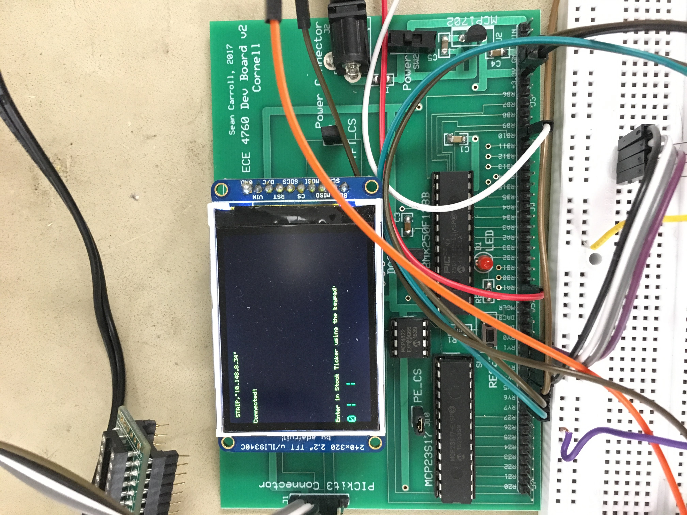
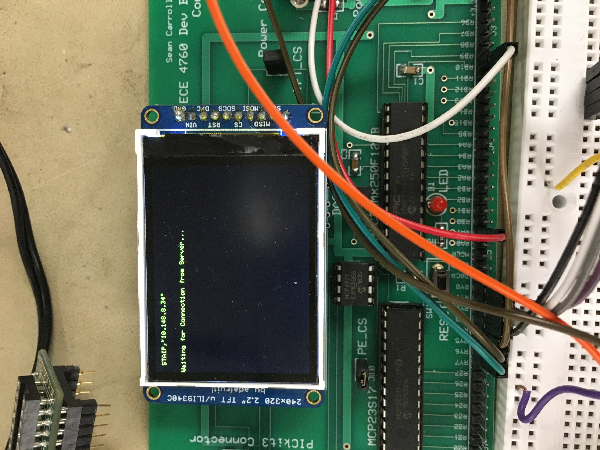
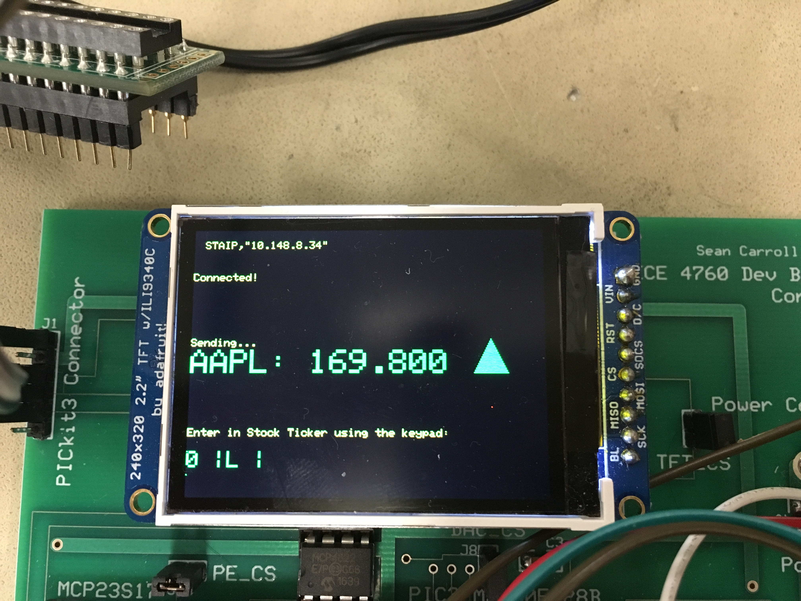
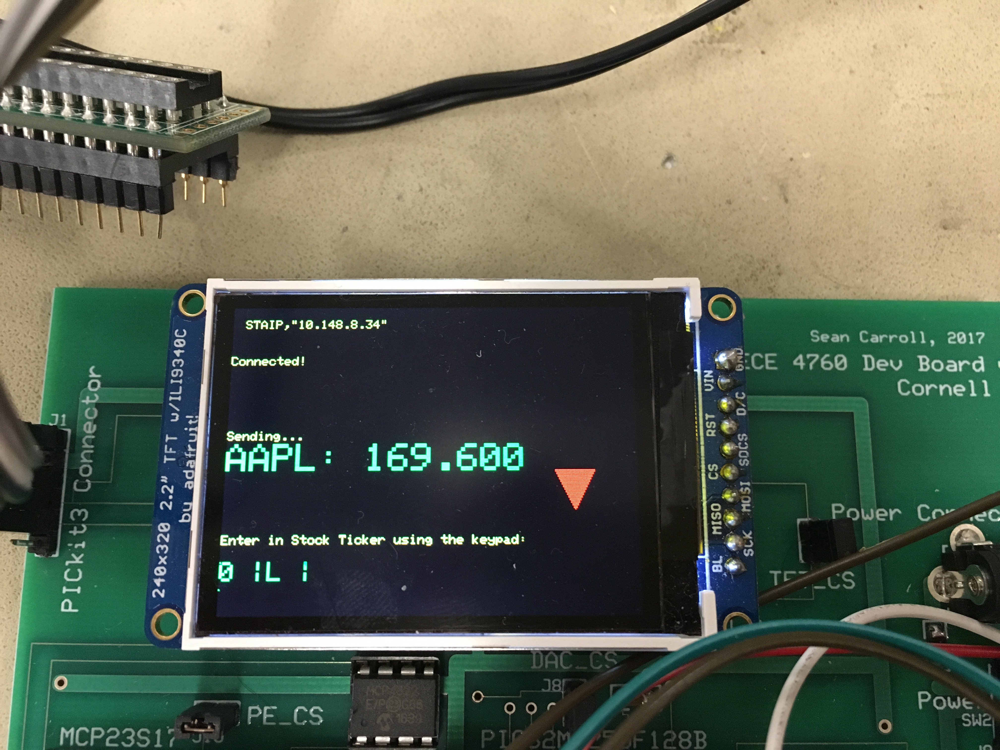
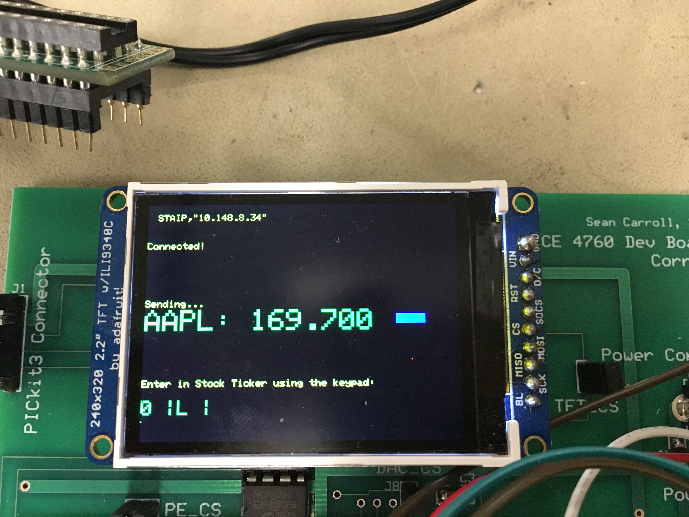

 <header><h1> <center> Real Time Stock Monitor </center>  <h1>
 <h3> using PIC32 and ESP8266 </h3></header>

### David Valley (drv34) | Saelig Khattar (sak283) | Shrinidhi Kulkarni (ssk285) 

# Introduction
In this project, we demonstrate a real-time stock monitor that uses the popular ESP8266 Wi-Fi module controlled by a PIC32.

We decided to build a fun device that fetches chosen stock prices in real-time and displays them on a screen. The goal was driven by a desire to create a PIC32 system that connects to the internet and can work as a server/client to perform several functions and eventually serve as a central home hub. The system can be easily modified to fetch any kind of data from the internet and display it as long as there is an API for it. 

# High Level Design
## Rationale
The rationale behind this project was that there exists almost no library or application of the PIC32 using the ESP8266. Both the chips individually are highly capable, cheap and can be used for even large scale manufacture. We wanted to create a prototype PIC32 system that has internet connectivity and can be easily extended to perform a multitude of things. Using protothreads for this makes this system only much more capable since this threading library is lightweight and makes it easy for anyone to use the PIC32. 

## Hardware and Software Tradeoffs 
In order to use the keyboard without rewriting most of the config file, we had to use the port expander. The alternative was to use the small board and rewrite the keyboard code. A software tradeoff []

## System Design
The system works as a TCP server that connects to a Python Client and fetches real-time stock information for whichever company the user inputs. The input is a 12-digit keypad which works similar to a cellphone keyboard. The user can input the stock symbol of the company required and the system displays the stock price on the LCD monitor along with the corresponding arrows for increase / decrease in stock price relative to the last fetch. This price is updated in real-time.


# Hardware Design 


# Software Design

## ESP8266 Wifi Module Setup

To set up the ESP module, we had to send it various  AT commands before we began to use it in our application. To check if the module worked, simply sending it “AT” via serial (which can easily be done using Putty or the Arduino Serial Monitor) and receiving the string “OK” would verify its proper operation. Next, we reset the module, using “AT+RST” to ensure any previous settings would not interfere with our current setup. 

Once we have ensured the module works and is reset, the next step was to connect the module to a Wifi Network. We used RedRover. To connect this module to RedRover, we first registered the device with Cornell IT, and then sent the AT command “AT+CWJAP_DEF=RedRover” to the module. Note, RedRover does not require a password to join the network, but the AT Command can accept a password argument. After it is connected, we can get the IP address of the module using “AT+CIFSR.” Next, we enable the ESP module to have multiple connections using “AT+CIPMUX=1” and configure the ESP module as a server using “AT+CIPSERVER=1”. After we sent this series of AT commands, the ESP module was ready to be used within our project.


Here is a code snippet used for the configuration:

```c
sprintf(PT_send_buffer,"AT+CIFSR\r\n");
   PT_SPAWN(pt, &pt_DMA_output, PT_DMA_PutSerialBuffer(&pt_DMA_output));
   PT_SPAWN(pt, &pt_input, PT_GetSerialBuffer(&pt_input));
   // Check for response from the module
   static char IP[21];
   tft_setCursor(10,10); tft_setTextColor(ILI9340_YELLOW);
   tft_setTextSize(1);
   strncpy(IP,PT_term_buffer+79,21);//get IP addr from the string AT+CIFSR returns
   tft_writeLine(IP);
   if(strstr(PT_term_buffer,"OK") != NULL){
       //tft_writeLine(PT_term_buffer);
   }
   else if(strstr(PT_term_buffer,"FAIL") != NULL){
       //tft_writeLine("IP Fail");
   }
```


## UART Communication Between ESP and PIC32
You can program and communicate with the ESP8266 Wifi Module using AT Commands. There are numerous AT Commands available for this module, and they are provided in Instruction Set Manual which is linked in the Appendix. The PIC32 communicated with the ESP module using UART Serial communication. We would send strings (or rather, character arrays) from the PIC32 to the ESP module containing the AT Command and would await a response the receive line of the PIC.  The exact process for sending and receiving messages via UART is described in greater detail in the next paragraph.

## Reading and Sending via UART
Reading and Sending messages via UART between the PIC32 chip and the ESP Wifi Module was also tricky. To do this, we used the function DMA_PutSerialBuffer provided by Bruce in example code and a heavily modified version of GetSerialBuffer. The DMA_PutSerialBuffer function would send the string placed in PT_send_buffer through UART to the ESP module using DMA one byte at a time. Modifying the GetSerialBuffer function was tricky because we could not find any documentation on how the ESP module responses were terminated. After experimenting, we concluded that most responses terminated with a ‘\n’ (new line) and ‘\r’ (carriage return) character in succession. We read up to 200 characters from the buffer (which was slightly more than the largest response we expected to receive) and stopped reading as soon as we saw that terminator. As each character was read, it was put into a character array that could be used by other functions. At the beginning of this function, we also cleared all UART2 errors. The reason for this is discussed in more detail in the testing and debugging section.

## Socket Communication Between ESP and our Python Client
The ESP communicated with our Python Client via a socket connection. The client connected to the module at its IP address on port 333 (the default when the ESP module is set up a server). The ESP module sent this client our custom commands based on user input on the keypad. The client received these commands, retrieved the necessary information (described in the next section), and sent this information back over the socket connection. The socket communication client side was handled by the standard Python socket library.

## Communication from Python Client to Intrinio Web API
Our Python client communicated with the Intrinio Web API using HTTP GET Requests. Based on the command it received from the ESP, the client would make the necessary GET request, format the response, and send it back to the ESP module. The GET requests were formatted based on the API requirements, and contained our API key . On an API call, Intrinio returned a JSON string with the necessary information. The client then parsed this JSON string to get the stock price. 
 
## Threads
### Keyboard Thread
The keypad thread is similar to the thread used in lab 2 for inputting parameters to be used in cricket call generation. One major difference however is the use of the port expander for the keypad. As outlined in lab 2, the wiring needed to scan the keyboards horizontal rows are mapped to pins RA0-RA3 on the PIC . In this lab, we were making use of RA1 for transmission from the PIC to the ESP module, and so we had to work around it in designing the keypad thread. It was not merely as simple as leaving everything in place and moving that one single wire to a different pin. This is because pins A0-A3 were selected specifically to make the code for scanning the keyboard simpler. This is the code from lab 2 of course, modeled off the sample code designed by Bruce, which works by reading the bits from each of pins A0-A3, and then the bits from each of B7-B9 (which map to the vertical columns of the keypad). The bits are then ORed together and the value compared against a lookup array which we define globally in the thread. 

Using a single different pin would mean different bit masks and subsequently produce different values which would not match any of the array entries. One solution to this is to manually calculate the expected values from these OR operations and construct a separate lookup table to correspond to these. Another, cleaner solution involved using the port expander. For this we referred to the example code written by Bruce which also made provisions for SPI communications. That element of it we did not need, however the code which initialized and set up the port expander, and of course the main keypad scanning logic, was left mostly intact, and needed virtually no further modification.

In addition to the main code pulled from the example sketch online, we added debouncing logic in a fashion similar to lab 2. In fact we reused nearly the exact same debouncing switch statement as the one used in that lab, modifying only the MaybePush state, which is where we put our ticker input logic to feed values to our API call.

To actually translate keypad number presses to letters, we make use of a second case statement. We had 27 cases, one for each letter of the alphabet, plus an additional space character. In our debouncing logic, once the pound sign was pressed, which worked as our ‘enter’ button, the current value in a running buffer would be passed as the argument to the second case statement. The letter corresponding to the numbers in the buffer would then be stored in a second ticker symbol buffer. Once a total of four characters was inputted (which is the max length for a NYSE stock symbol), the buffers would reset, and an API call would be made using that ticker.

### Wifi Config Thread
We put the code for the setup process described in the section “ESP8266 Wifi Module Setup” into this thread. 

### API Call Function (on the PIC)
The API Call Function is perhaps the most important function of our project. It is responsible for sending a custom command to the ESP via serial based on the stock ticker the user entered on the keypad, getting the returned stock price, and displaying this price (along with its ticker) as well as a triangle to indicate how the price instantaneously changed on the TFT LCD.  Since we ran into many problems trying to receive the responses to stock price requests on the PIC (as discussed in the “Testing and Debugging” section), we created a custom GetStock function that would read a preset number of characters from the buffer. This was feasible to do because the response containing the stock price was always the same number of characters. We would then parse this response to get only the stock price so we could display it and compare it with the last price.

### Main Thread
To make the software design more structured and the software workflow more clearer, we developed a “main” protothread. This thread first spawned the Wifi Config thread, which would set up the ESP module and display its IP address on the screen. This thread was also responsible for awaiting for a connecting from our Client and blocking the rest of the system until this requirement was satisfied. Once it had detected the client had connected, it would then check to see if a stock ticker had been entered. If so, it made an API call which would update the corresponding stock price on the TFT in real-time.

### Main Function
In our main function, we set up protothreads, enabled interrupts, set up the TFT display, and initialized and scheduled all of our protothreads.

# Testing and Debugging
## ESP Setup
Interfacing the ESP module with the PIC was significantly harder than we expected and took a considerable part of the time we spent working on this project. Initially, we were sending AT commands from the PIC to the ESP module to set it up. We were not receiving any response from the module on the PIC (we were displaying the response on the TFT), so we tried to verify this using an oscilloscope. Indeed, nothing was being sent to the PIC from the ESP module. After we rechecked the wiring, we realized that we had connected the two Transmit (TX) pins together and the two Receive (RX) pins together! We also started utilized the Arduino Serial Monitor to quickly send AT commands and read the ESP module responses, as opposed to programming the PIC to do it, which was relatively time-intensive. Once we fixed the wiring issue and started using the Arduino Serial Monitor, we were able to set up the ESP module as a server and get its IP address with relative ease.
## Reading and Sending from UART
Once we stopped sending commands from the serial monitor for quick testing purposes and starting sending them from the PIC32, we ran into more issues. We could not find any documentation on how the ESP responses were terminated, so we had to make educated guesses. We tried reading each line separately, a fixed number of characters, and read until various terminators. Eventually, after much experimentation, we found that reading the UART receive line until the ‘\n\r’ terminator worked well for most ESP responses. Unfortunately, this approach did not work for responses to API calls, which was crucial to our project. In fact, we realized that when we sent the AT command to the ESP to make an API call, no response was returned at all (this was verified by the Arduino Serial Monitor). We initially had several errors in the actual API call we were making, and were having trouble encoding the API key and password into the call itself. We experimented with many different Financial Market APIs, and settled for Intrinio’s as it was free to use and could return responses in JSON format, which we hoped would be easy to parse. However, even after we figured out to correctly make an API call and encode the key and password (verified by entering in the call into a browser), we still were not receiving anything on the ESP module. After spending about a week trying to resolve this issue, we decided that a different approach needed to be taken.

After some deliberation, we determined that creating an intermediary between the ESP module and Intrinio’s Web API would be the best solution. This intermediary took the form of a Python based client that could connect to both the ESP module via sockets and the API via HTTP. We then sent custom-made commands from the ESP to the Python client, and the Python client would make the appropriate API Call. The client could then get the response from the API, and send over the information to the ESP. This approach proved to work quite well.

Once we had resolved this issue, we still had the issue of reading ESP responses on the PIC when we made these API calls. Since our original function was not working for this specific case, we decided to create a new function specifically for API calls. This new function only read a fixed number of characters from UART, and took advantage of the fact that all stock related responses were of fixed length. Unfortunately, we were still not able to read anything, even with this new function. After some more experimentation and a recommendation from Bruce, we had the function clear all UART2 errors before it tried reading anything. This solved our issue!! This means that the UART was throwing some error, and as a result it was locking the buffer, not allowing our program to read it.

## Keyboard 
The process for testing and debugging the keyboard thread was similar to the process used in lab 2. One important change was the use of the port expander. Debugging this was not entirely difficult, as the code to initialize and scan for a keypress was provided in an example sketch written by Bruce and posted on the website. The debouncing logic too, was borrowed from our code for lab 2, which we knew to work very reliably. The only major issue was integrating those two pieces with the third case statement, and subsequently printing results of the keypresses to the tft display. Solving many of these issues came down to changing variable names and cutting down unnecessary code.

# Results
We pivoted a few times in the course of designing our final project, and finished with something a bit different. The core functionality remained the same of course, this being wifi communication with the ESP module, however the immediate application of that differed slightly from what we’d originally intended. Our reasons for pivoting are in themselves significant, shedding a fair amount of light on the nature of wireless communication as well as highlighting some of the shortcomings we were bound to face, while also helping us understand the versatility and useability of the ESP module to extend to many other projects. Before settling on stock price api calls, we had wanted to do wireless music streaming. In theory this seemed similar to stock calls, however we realized that the problem becomes a fair bit more complicated when we stray away from communicating to servers with dedicated api call frameworks. Getting music streaming to work in the way we’d intended would have involved offloading a lot of the processing work to the server side, which we did not want.

As to the actual technical details of our system, we finished with a pretty reliable framework for making api calls to financial data servers. The latency for a call was roughly one second, and the stock prices updated every ten seconds (manually set to avoid spamming API and reaching the daily call limit), provided we left the PIC running without requesting a different stock quote. Initial configuration of the chip takes about two seconds, meaning we finished with a system with relatively small startup costs, and which makes quick and accurate updates in real time. Additionally, we reported stock prices to two decimal points accuracy.








# Extensions
An important aspect of this project to note is its extensibility to other projects and applications of the PIC32 microcontroller. In general, this project served as demonstration of the PIC32 microcontroller as a TCP server and client. It’s functionality in this way can be easily applied to other peripheral circuits or additional modules. Wireless communication makes many new functions possible, and allows us to increase the usability and relevance of our smarthome merely by incorporating additional API calls and data requests to various external servers. An original extension to this project was the communication of weather data from the national weather service to the PIC. In general, any database accessible with similar API calls can be incorporated into this project. 

Aside from the incorporation of API calls and data requests to external servers, Wi-Fi communication with the PIC could be used in various other respects, it is extremely versatile in that way. Any sort of light display, temperature control circuit, home security unit, or IoT application could be implemented using the ESP module and serial communication over the PIC .

As mentioned, one interesting add-on to this project is weather service data. In a similar fashion to our own stock quote requests, we could make API calls to servers of the national weather service and display temperature, environmental conditions, and general weather data on our TFT display. We could take this even further by then analyzing the weather data and, based on the conditions, stream music that fits the mood of said weather. Streaming would of course occur via Wi-Fi communication with the ESP module. We in fact originally considered live music streaming with the module, however due to time constraints pivoted and decided on stock API calls.


# Conclusion
Overall it is fair to conclude that the results of the project met our expectations, albeit with various complexities along the way. In a broad sense our project served as a proof of concept for lightweight wireless communication projects using Wifi over the ESP module. We pivoted early on as far as the direction we wanted to take our project in, however in the end made great progress in determining the versatility and extensibility of the ESP module and Wi-Fi communication to the PIC .

It is worth mentioning that, while this project could have been done without using Protothreads or any of our previously used threading libraries, their compact and lightweight nature fit in very well with how our code was broken down. As discussed, our code can be broken down into perhaps three major components: the keypad component, the initial configuration code, and the actual API calls. It worked quite naturally to have each one in its own thread and running continuously. Furthermore, in a fashion similar to inline function calls, whenever external functionality was needed which was not explicitly provided by one of our threads, we could spawn protothreads, which would initialize, execute a given function, and terminate, yielding the processor back to the calling thread. In this way we were able to explore the usability and extensibility of protothreads in applications to communication protocols outside the normal scope of the previous four labs.

It is certainly fair to say that there were many unexpected delays in the development of this project. Something to change would of course to make one of the labs focused on serial communication. This has been a lab in previous semesters of the class, and the general sentiment of including it as a lab is held by most of the staff, Bruce included. While there were of course various aspects to our project outside of serial communication, having a previous lab focus solely on that would have helped reduce the startup costs tremendously in terms of spending time learning the material we needed for our project.

## Patents and Legal
There are several cellphone apps and standalone systems that do a very similar application. However, almost no application uses a PIC32 to do this. Our entire project costs less than 35$ and can be used as a stock display system on a desk. Since almost all of our code is our own or made available to us during the course, there are no intellectual property or legal issues.

## Ethical Considerations
Part A of IEEE Policies, Section 7.8, describes 10 specific considerations that engineers are to abide by and agree to when working in any capacity as an electrical or electronics engineer. We will not include the entirety of the code here, but rather would like to summarize and emphasize a few key points made in the document. Two of the more relevant points in the list of ten would be numbers 5 and 7, which say respectively:

_“5. To improve the understanding by individuals and society of the capabilities and societal implications of conventional and emerging technologies, including intelligent systems;_ 
 
_7. To seek, accept, and offer honest criticism of technical work, to acknowledge and correct errors, and to credit properly the contributions of others;”_

In specific reference to our own project, and in fact to many of the projects in the class, consideration of these two points is of the utmost importance, and perhaps the most relevant. A “smart hub” capable of tracking and keeping real time updates of financial data is very useful in many applications today, and many extensions to our project have the potential to extend our understanding of conventional and emerging technologies. A growing trend today is the development of ‘smart’ devices that are increasingly interconnected,  allowing us to create and spread new information at alarmingly high rates. Our project and subsequently this report is an investigation into the feasibility, usability, and versatility of wifi connected devices and applications using wireless communication. Addressing the second point listed above, we feel that above all else, the nature of this course is concisely described by point seven in the code. Being a purely lab/project based class, it is no surprise that we seek, accept, and offer criticism in nearly every part of the course. We look for solutions to problems by asking instructors, TAs, other lab groups, online references, and more, and constantly work to refine our designs using information learned from these resources. Crediting the work of others is stressed in every part of the course, especially in the final project where it is usually up to us to find outside material to inform our decision making and code design. In this way we maintain the IEEE’s standards and Code of Ethics, with special attention paid to points 5 and 7 of the code.
___
# Appendices 
## Appendix A
_The group approves this report for inclusion on the course website_
_The group approves the video for inclusion on the course youtube channel_

## Appendix B: Code
Link Github

## Appendix C: Schematics

## Appendix D: Cost Details

For this project, we bought one additional piece of hardware, the ESP wifi module. Aside from that, everything else was borrowed from lab, with reference prices listed below, taken from the 4760 website:

ITEM | COST
-----------------|--------------------------
ESP-8266 WiFi Module by Sparkfun - 1568-1235-ND Digikey reference|$6.95
MicroStickII|$1
Big Board|$10
Breadboard|$6
Power Supply|$5
PIC32MX250F128B|$5
TFT LCD|$10
Keypad|$6
30 jumper cables $0.10 each|$3
------------------------|---------------------
TOTAL|$52.95

## Appendix E: Work Distribution

Saelig Khattar | David Valley | Shrinidhi Kulkarni
---------------|--------------|--------------------
Helped get ESP Wifi-module setup | Implemented Port Expander for keypad thread | Setup and configuration of the ESP module (which was basically reading the entire manual for the ESP chip)|Setup the communication protocol between the ESP and the python client and tested it
Helped Interface ESP chip with PIC32 chip (including the many tens of hours debugging)| Modified debouncing logic to scan new keypad and update ticker symbols|Tested communication extensively between the ESP and the Python client
Helped write Python script to make API calls and communicate with ESP module | Helped with hardware setup and wiring|Wrote the original python test script
Solved inability to read stock related responses from ESP | Helped identify Intrinio as our goto API data server, and how to format JSON calls | Integrated the keyboard and wifi communication threads on the PIC 
Designed the UI | Helped with UI design | Debugged minor issues during integration 
Structured code to make it easier to follow and less prone to error | Helped debug configuration thread |
Added error handling for faulty or broken API Calls ||

## Appendix F: References

[ESP8266 Module Datasheet](https://cdn.sparkfun.com/datasheets/Wireless/WiFi/ESP8266ModuleV1.pdf)

[Wifi Communication Using ESP8266 and PIC32](https://people.ece.cornell.edu/land/courses/eceprojectsland/STUDENTPROJ/2014to2015/mr945/ESP8266_Independent%20Study_mr945.pdf)
 
[PIC32 Family Reference Manual - Section 21: UART - Microchip](http://ww1.microchip.com/downloads/en/DeviceDoc/61107G.pdf)

[PIC32 Pinout](http://people.ece.cornell.edu/land/courses/ece4760/PIC32/Microchip_stuff/PIC32MX250F128B_pinput.PNG)

[UART Serial](http://people.ece.cornell.edu/land/courses/ece4760/PIC32/index_UART.html)

[Port Expander Reference Code (Additionally printLine2() is used from this code)](http://people.ece.cornell.edu/land/courses/ece4760/PIC32/Target_board/TFT_KEY_expander_shift_BRL4.c)

Used some sample code for UART communication available under section “[Serial Console, Port Expander, DAC/DDS, TFT]”
(http://people.ece.cornell.edu/land/courses/ece4760/PIC32/target_board.html)

[Python Sockets](https://docs.python.org/2/howto/sockets.html)

